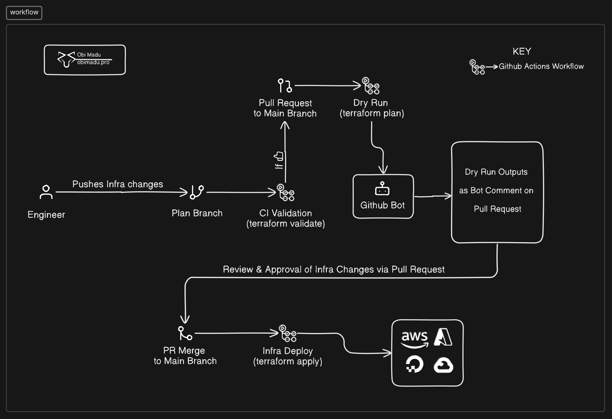

# Implementing the Terraform core workflow in Collaboration 
## via Github Pull Requests, Actions, Bot, Environments & a Remote Backend.

Hello! and welcome!! In this project we're going to be creating some simple Infrastructure with Terraform while implementing the Terraform core workflow (which are write, plan & apply) in Collaboration at a Production capacity. Put simply we're going to be deploying Infrastructure with Terraform in a way that allows for a team of engineers to introduce changes to the system, have it reviewed in full details, approved or denied, and (if approved) deployed to Production.

The system we're going to build in this project will be suitable for the operations of some small to medium sized organizations (with or without the possible addition of a few more things we'll talk about at the end of the project).

For the purpose of this project, you're an Infrastruture Engineer tasked with creating initial Infrastructure for a medium sized company. We'll start by creating our infrastructure from scratch, working with Version control (Git) all the way, bootstrapping our system through a Local Backend on our workstation, migrating it to a Remote Backend to enable collaboration & creating scripts to automate the entire Continuous Integration and Continuos Deployment process.

We'll be:

- [x] Creating barebones Infrastructure with Terraform on DigitalOcean & Cloudflare
- [x] Configuring a Google Cloud Storage Remote Backend to enable Collaboration
- [x] Configuring access to our GCS Backend via Github Environments & Actions workflows
- [x] Creating Actions Workflow scripts to Initialize, Validate, Preview and Apply our Infrastructure changes.
- [x] Making use of Github Pull Requests and the Github Bot for Proposed Infrastructure changes Reviews ( & Approval or Denials).

Visit the link to the Full project walkthrough/documentation on my blog to dive in: [https://blog.obimadu.pro/terraform-github-workflow/](https://blog.obimadu.pro/terraform-github-workflow/)